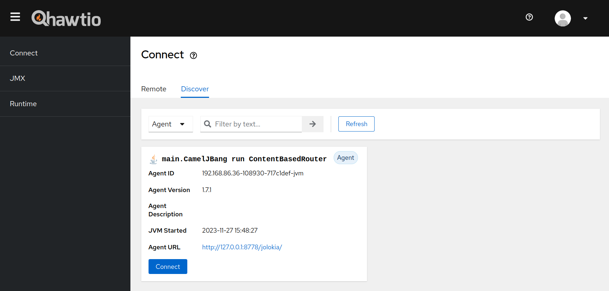
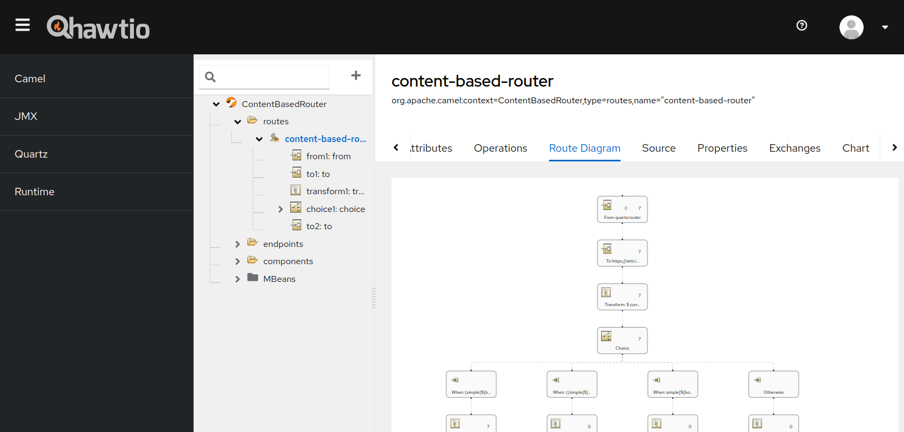

# How to use Hawtio with Camel JBang

[Camel JBang](https://camel.apache.org/manual/camel-jbang.html) is the fastest and preferable way to start developing your Camel application. This example demonstrates how you can use Hawtio with Camel JBang.

The instructions are explained in the Camel user manual here:

- [Camel JBang - Using Jolokia and Hawtio](https://camel.apache.org/manual/camel-jbang.html#_using_jolokia_and_hawtio)

## How to use

In essence, here are what you need to do to use Hawtio with Camel JBang.

Firstly, run the example Camel route:

```console
camel run ContentBasedRouter.java
```

In another terminal, attach a Jolokia agent to the running route and then open Hawtio:

```console
camel jolokia ContentBasedRouter
camel hawtio --version=4.3.0
```

You can also combine the two commands in a single one with `camel hawtio`:

```console
camel hawtio --version=4.3.0 ContentBasedRouter
```

Once the Hawtio console is open, go to `Connect` -> `Discover` tab. You will see the running route `ContentBasedRouter` is discovered.



Hit the `Connect` button and you will see the Camel plugin view with the tree of the running Camel route contents.


