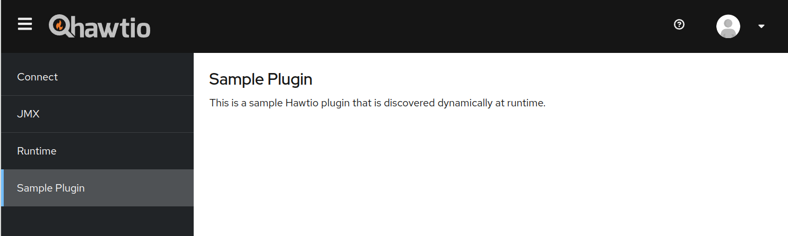

# Hawtio simple WAR plugin example

This sample application demonstrates how to write a plugin for [Hawtio v3+](https://github.com/hawtio/hawtio) as a WAR file; WAR plugins are useful when deploying Hawtio and plugins to an application server such as Jetty, WildFly, and Tomcat.

## How to run

Build the project:

```console
mvn install
```

Then run it with Jetty locally:

```console
mvn jetty:run
```

Hawtio is available at <http://localhost:8080/hawtio>. Check that `Sample Plugin` is loaded at the navigation sidebar.



## Deploying to a server

Copy the war file `target/war-plugin.war` to the `standalone/deployments/` directory for WildFly or the `deploy/` directory for Apache Tomcat / Jetty.
